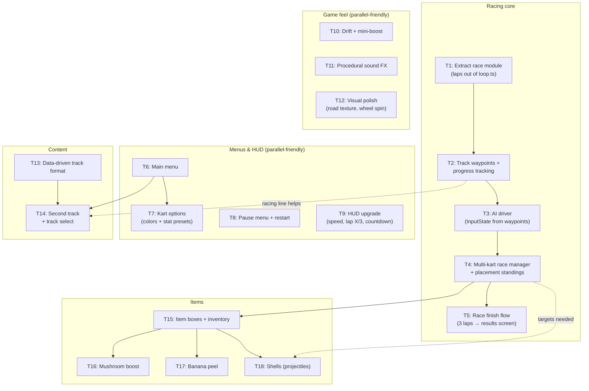

# Next Steps — Agent Task Board

Bite-size, independently-shippable tasks derived from `ROADMAP.md`, sized for a single Claude Code or Codex session each. Rules of engagement:

- **One task = one branch = one PR.** Name branches `feat/<task-id>-short-name` (e.g. `feat/T3-ai-driver`).
- **Claim a task** by noting it in `HANDOFF.md`'s "Next up" section when you start, and update `HANDOFF.md` + check the box here in your final commit.
- **Respect dependencies** (diagram below). Tasks with no unmet dependencies are fair game to run in parallel.
- **No binary assets** — see the asset strategy in `ROADMAP.md`. Procedural geometry, `CanvasTexture`, and WebAudio-generated sound only, unless a task says otherwise.
- **Keep `npm run build` green.** It's the merge bar for every PR.

## Dependency graph

Solid arrows are hard dependencies; dotted arrows mean "much easier after". Everything in **Menus & HUD** and **Game feel** can start immediately with no dependencies (except T7 after T6).

## Ready now (no unmet dependencies)

### T1 — Extract race module ~S
Lap counting currently lives inline in `src/game/loop.ts` for a single kart. Move it into a new `src/race/race.ts` that tracks per-kart lap count and finish-line cooldown, so multiple karts can race. `loop.ts` keeps only: input → physics → camera → race.update → render.
**Done when:** behavior unchanged in-game; `loop.ts` no longer owns lap state; race module has a per-kart API (`addKart`, `update(dt)`, `getLaps(kart)`).

### T2 — Track waypoints + progress tracking ~M *(after T1)*
Add an ordered loop of waypoints around the ring track in `src/track/track.ts` (or `src/track/waypoints.ts`), plus per-kart "current waypoint index / race progress" tracking in the race module. This is the backbone for AI steering (T3) and position/placement (T4), and prevents lap-count cheating by reversing over the line.
**Done when:** a debug overlay (toggle with a key, e.g. `0`) draws waypoints; progress increases monotonically as you drive a lap correctly.

### T6 — Main menu ~S
HTML/CSS overlay (same pattern as the HUD in `index.html`/`src/style.css`): title + "Start Race" button; game bootstraps but doesn't start the loop/input until Start is clicked. Structure it as a simple screen-state machine (`menu` → `racing`) in `src/main.ts` or a new `src/ui/screens.ts`, since Pause (T8) and Results (T5) will add more states.
**Done when:** page loads to menu; Start begins the race; Esc back to menu resets the kart.

### T7 — Kart options ~S *(after T6)*
A `KartConfig` (body color, plus stat presets: e.g. Speedy / Balanced / Heavy modifying `MAX_SPEED`/`ACCELERATION`/`TURN_RATE_MAX` multipliers). Menu gains a kart picker (3–4 presets). Constants stay in `src/kart/controller.ts`; the config supplies multipliers.
**Done when:** picking a different kart visibly changes color and feel.

### T8 — Pause menu + restart ~S
Esc during a race pauses (loop stops advancing physics but keeps rendering, or freezes entirely), overlay offers Resume / Restart. Restart resets kart position, speed, laps.
**Done when:** pause fully freezes gameplay; restart gives a clean race state without a page reload.

### T9 — HUD upgrade ~S
Speedometer (from `kart.speed`), "Lap X/3" format, and a 3-2-1-GO countdown at race start during which input is ignored.
**Done when:** countdown gates the race start; HUD shows live speed and lap out of total.

### T10 — Drift + mini-boost ~M
Hold a drift key (Shift/Space) while turning: kart slides (heading and velocity direction diverge slightly), and holding a drift ≥ ~1s grants a short speed boost on release. All constants in `src/kart/controller.ts`. This is the single biggest "feels like Mario Kart" win.
**Done when:** drifting around the ring's corners is controllable and boost fires on release; non-drift handling unchanged.

### T11 — Procedural sound FX ~M
WebAudio-only (no audio files): engine hum pitched by speed, wall-bump thunk, lap chime. New `src/audio/` module; must start suspended and resume on first user gesture (browser autoplay policy).
**Done when:** sounds react to gameplay; no console autoplay warnings; a mute toggle exists.

### T12 — Visual polish ~S
Procedural `CanvasTexture` road (edge stripes / checkered finish line), wheels that spin with speed and steer with input, simple shadow blob under the kart.
**Done when:** motion reads clearly on screen; still zero external asset files.

### T13 — Data-driven track format ~M
Refactor `src/track/track.ts` so geometry/walls/finish line/waypoints are built from a plain-data `TrackDefinition` object (start with the current ring as `tracks/ring.ts`). Collision can stay rectangle-based for now but should live behind the definition, not hardcoded in the class.
**Done when:** current track is defined purely as data; adding a hypothetical second definition requires no changes to track-building code.

## Blocked (waiting on dependencies)

### T3 — AI driver ~M *(needs T2)*
`src/ai/driver.ts`: produces an `InputState` (steer toward next waypoint, throttle with simple corner slowdown). Reuses `updateKart` from `src/kart/controller.ts` unchanged — AI karts are just karts with a different input source (this was designed for; see `HANDOFF.md`).
**Done when:** one AI kart completes laps unassisted without getting permanently stuck.

### T4 — Multi-kart race manager + placement ~M *(needs T3)*
3–4 AI karts + player, staggered starting grid, live placement ("3rd/4th") from lap + waypoint progress, standings in HUD. Kart-vs-kart collision can be simple radius push-apart (or deferred — note it in the PR either way).
**Done when:** a full field races and the placement shown matches what you see.

### T5 — Race finish flow ~S *(needs T4)*
Race ends after 3 laps: results screen (final standings), player input cut after finishing (simple auto-drive or stop is fine), Restart / back-to-menu options.
**Done when:** finishing 1st and finishing last both produce a correct results screen.

### T14 — Second track + track select ~M *(needs T13, T6)*
A second `TrackDefinition` with a different shape (e.g. L-shape or figure-8 footprint using the same rectangle-collision vocabulary), and a track picker in the menu.
**Done when:** both tracks are completable with correct lap counting; menu selects between them.

### T15 — Item boxes + inventory ~M *(needs T4)*
Floating item-box meshes on the track that grant a random item on drive-through (respawn after a few seconds), single-slot inventory in HUD, use-item key. Items themselves are stubs (T16–T18).
**Done when:** boxes grant/respawn correctly and the HUD shows the held item.

### T16 — Mushroom boost ~S *(needs T15)* — instant speed burst on use.
### T17 — Banana peel ~S *(needs T15)* — dropped behind kart; spins out (brief input lock + speed loss) any kart that hits it.
### T18 — Shells ~M *(needs T15, T4)* — green: straight-line bouncing projectile; red: homes on the kart ahead (waypoint progress gives you "who's ahead" for free).

## Later (design before coding — don't start yet)

- **Local split-screen** — two cameras/viewports, shared keyboard; forces a "player vs kart" refactor. Do after T5.
- **Battle mode** — arena track definition + balloon health; reuses items (T15–T18).
- **Online multiplayer** — needs a relay server and a hosting decision (breaks the static-only deploy). Write a design doc first; see `ROADMAP.md`.

## Suggested claiming order

Two agents working in parallel, minimal collision risk:

| Agent A (racing core) | Agent B (UX/feel) |
|---|---|
| T1 → T2 → T3 → T4 → T5 | T6 → T9 → T8 → T10 → T7 |

Then converge: T13/T14 (content) and T15–T18 (items) in either lane. T11/T12 are gap-fillers any session can pick up.
